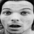
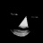
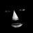
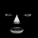
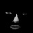
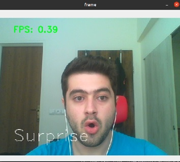

# RetinaFace-Emotion-Detection

Facial Expression Recognition with RetinaFace as face detector and Region of Interest (RoI) based ResNet as Emotion Detector

### Docs
- [Report - fa](https://raw.githubusercontent.com/ali-sedaghi/RetinaFace-Emotion-Detection/main/docs/Report-fa.pdf)
- [Slides - en](https://raw.githubusercontent.com/ali-sedaghi/RetinaFace-Emotion-Detection/main/docs/Slides-en.pptx)


### Wrapper on our other repositories
- [Facial-Landmark-Detection](https://github.com/ali-sedaghi/Facial-Landmark-Detection)
- [RoI-ResNet](https://github.com/ali-sedaghi/RoI-ResNet)
- [FaceNet-FER2013](https://github.com/ali-sedaghi/FaceNet-FER2013)
- [ResNet50-CIFAR10-FER2013](https://github.com/ali-sedaghi/ResNet50-CIFAR10-FER2013)
- [AffectNet-Trainer](https://github.com/ali-sedaghi/AffectNet-Trainer)


### Classes

1. Angry
2. Disgust
3. Fear
4. Happy
5. Sad
6. Surprise
7. Neutral

## Model Checkpoints

You need to place checkpoints in ```checkpoints``` folder.
- RetinaFace model weights: [[Download]](https://drive.google.com/drive/folders/1kyIUlhB38igMCPTRgfZh536fUpAi3uOK?usp=sharing)
- Dlib landmark detector model weights [[Download]](https://drive.google.com/file/d/1CiwW6vJjFl22dQHR4fRC0lN2_pfsGVmM/view?usp=sharing)
- RoI ResNet56 trained on FER2013 model weights [[Download]](https://drive.google.com/file/d/1At3fv5F_47z8yidllaTveoS13itIqgkf/view?usp=sharing)


## How to run

Change directory to code folder
```bash
cd code
```

Install dependencies
```bash
conda env create -f environment.yml
```
```bash
conda activate retinaface-roi
```

Image and results will be saved in results folder
```bash
python run.py --img_path="../photos/test1.jpg"
```

Webcam
```bash
python run.py --webcam=True
```


## Results

Input


Detected faces using RetinaFace





RoI Mask








Output (from left to right)
1. Happy
2. Happy
3. Neutral
4. Surprise
5. Surprise

## Webcam Demo

```bash
python run.py --webcam=True
```




## References

https://github.com/peteryuX/retinaface-tf2
